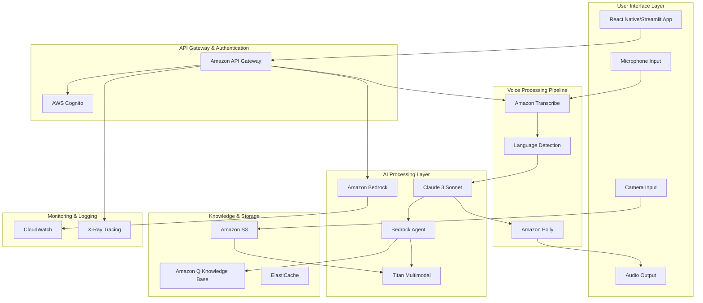
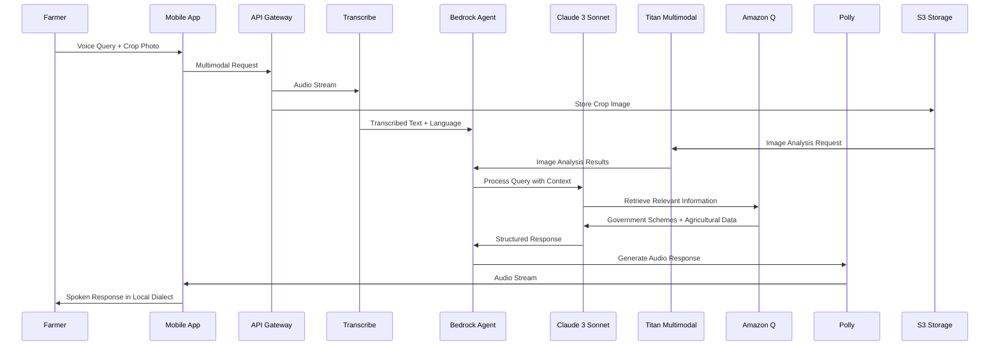

# Design Document: Krishi-Setu (AI Bridge for Farmers)

## Overview

Krishi-Setu is a multimodal AI-powered agricultural assistance platform designed specifically for rural farmers with limited or no literacy skills. The system leverages AWS cloud services to provide a voice-first, vision-enabled interface that processes spoken queries in local dialects and analyzes crop images to deliver actionable agricultural advice and government scheme information.

The architecture follows a serverless, event-driven design using AWS managed services to ensure scalability, reliability, and cost-effectiveness. The system integrates Amazon Transcribe for speech recognition, Amazon Bedrock with Claude 3 Sonnet for intelligent processing, Amazon Titan Multimodal for image analysis, Amazon Q for knowledge retrieval, and Amazon Polly for speech synthesis.

## Architecture

### High-Level Architecture



### Data Flow Architecture



## Components and Interfaces

### 1. Frontend Application (React Native/Streamlit)

**Purpose**: Zero-literacy user interface with voice and image capture capabilities

**Key Features**:
- Large, icon-based navigation
- Voice recording with visual feedback
- Camera integration for crop photos
- Audio playback controls
- Offline capability indicators

**Interface Specifications**:
```typescript
interface VoiceInput {
  startRecording(): Promise<void>
  stopRecording(): Promise<AudioBlob>
  getAudioLevel(): number
  isRecording(): boolean
}

interface ImageCapture {
  capturePhoto(): Promise<ImageBlob>
  selectFromGallery(): Promise<ImageBlob>
  validateImageQuality(image: ImageBlob): boolean
}

interface AudioOutput {
  playResponse(audioUrl: string): Promise<void>
  pausePlayback(): void
  setPlaybackSpeed(speed: number): void
  getPlaybackStatus(): PlaybackStatus
}
```

### 2. Voice Processing Pipeline

**Amazon Transcribe Configuration**:
- Language identification for Hindi and Indian English
- Custom vocabulary for agricultural terms
- Noise reduction and speaker diarization
- Real-time streaming transcription

**Language Detection Service**:
```python
class DialectEngine:
    def detect_language(self, audio_stream: bytes) -> LanguageResult
    def enhance_transcription(self, text: str, confidence: float) -> str
    def validate_agricultural_terms(self, text: str) -> ValidationResult
```

### 3. AI Processing Layer

**Amazon Bedrock Agent Configuration**:
- Claude 3 Sonnet for natural language understanding
- Titan Multimodal for image analysis
- Custom prompt templates for agricultural context
- Multi-turn conversation management

**Core Processing Interface**:
```python
class KrishiSetuAgent:
    def process_multimodal_query(
        self, 
        voice_text: str, 
        image_data: Optional[bytes],
        user_context: UserContext
    ) -> ProcessedResponse
    
    def analyze_crop_image(self, image: bytes) -> CropAnalysis
    def retrieve_government_schemes(self, query: str, location: str) -> List[Scheme]
    def generate_contextual_response(self, analysis: CropAnalysis, schemes: List[Scheme]) -> str
```

### 4. Knowledge Base (Amazon Q)

**Government Schemes Database**:
- Structured data from official government sources
- Regular updates through automated scraping
- Eligibility criteria and application procedures
- Regional and crop-specific filtering

**Agricultural Knowledge Repository**:
- Crop disease identification database
- Pest management recommendations
- Seasonal farming advice
- Weather-based guidance

**Knowledge Base Schema**:
```json
{
  "scheme": {
    "id": "string",
    "name": "string",
    "description": "string",
    "eligibility": ["string"],
    "benefits": ["string"],
    "application_process": "string",
    "deadline": "date",
    "applicable_states": ["string"],
    "crop_types": ["string"]
  },
  "crop_disease": {
    "id": "string",
    "name": "string",
    "symptoms": ["string"],
    "affected_crops": ["string"],
    "treatment": "string",
    "prevention": "string",
    "severity": "enum"
  }
}
```

### 5. Image Analysis Service

**Titan Multimodal Integration**:
- Crop disease detection and classification
- Pest identification with confidence scores
- Growth stage assessment
- Nutritional deficiency analysis

**Image Processing Pipeline**:
```python
class CropImageAnalyzer:
    def preprocess_image(self, image: bytes) -> ProcessedImage
    def detect_diseases(self, image: ProcessedImage) -> List[Disease]
    def identify_pests(self, image: ProcessedImage) -> List[Pest]
    def assess_crop_health(self, image: ProcessedImage) -> HealthScore
    def generate_recommendations(self, analysis: ImageAnalysis) -> List[Recommendation]
```

### 6. Response Generation Service

**Amazon Polly Configuration**:
- Kajal voice for Hindi and Indian English
- Custom pronunciation for agricultural terms
- SSML markup for natural speech patterns
- Adaptive speech rate based on content complexity

**Response Formatting**:
```python
class ResponseGenerator:
    def format_for_audio(self, response: str, dialect: str) -> str
    def add_pronunciation_guides(self, text: str) -> str
    def structure_long_responses(self, content: str) -> List[str]
    def generate_ssml(self, text: str, emotion: str) -> str
```

## Data Models

### User Context Model
```python
@dataclass
class UserContext:
    user_id: str
    preferred_language: str
    location: GeoLocation
    farm_size: Optional[float]
    primary_crops: List[str]
    previous_queries: List[QueryHistory]
    accessibility_preferences: AccessibilitySettings
```

### Multimodal Query Model
```python
@dataclass
class MultimodalQuery:
    query_id: str
    timestamp: datetime
    voice_input: VoiceInput
    image_input: Optional[ImageInput]
    user_context: UserContext
    processing_metadata: ProcessingMetadata
```

### Response Model
```python
@dataclass
class KrishiSetuResponse:
    response_id: str
    query_id: str
    text_response: str
    audio_url: str
    confidence_score: float
    sources: List[InformationSource]
    follow_up_suggestions: List[str]
    estimated_audio_duration: int
```

### Government Scheme Model
```python
@dataclass
class GovernmentScheme:
    scheme_id: str
    name: str
    description: str
    eligibility_criteria: List[str]
    benefits: List[Benefit]
    application_process: ApplicationProcess
    deadlines: List[Deadline]
    contact_information: ContactInfo
    required_documents: List[str]
    applicable_regions: List[str]
```

### Crop Analysis Model
```python
@dataclass
class CropAnalysis:
    analysis_id: str
    image_metadata: ImageMetadata
    detected_issues: List[CropIssue]
    health_score: float
    growth_stage: GrowthStage
    recommendations: List[Recommendation]
    confidence_scores: Dict[str, float]
```

Now I need to use the prework tool to analyze the acceptance criteria before writing the Correctness Properties section.

<function_calls>
<invoke name="prework">
<parameter name="featureName">krishi-setu

## Correctness Properties

*A property is a characteristic or behavior that should hold true across all valid executions of a system—essentially, a formal statement about what the system should do. Properties serve as the bridge between human-readable specifications and machine-verifiable correctness guarantees.*

Based on the prework analysis, I've identified several redundant properties that can be consolidated:

**Property Reflection:**
- Properties related to audio processing (1.1, 1.4, 1.5) can be combined into comprehensive audio handling properties
- Performance properties (1.3, 2.1, 7.2) can be grouped by response time requirements
- Data security properties (6.1, 6.2, 6.5) can be consolidated into comprehensive data protection properties
- Multimodal integration properties (9.1, 9.2, 9.3, 9.4, 9.5) can be combined into fewer comprehensive properties

### Core Functional Properties

**Property 1: Voice Input Processing Completeness**
*For any* audio input containing speech in supported dialects, the Voice_Pipeline should successfully capture, process, and transcribe the content while filtering background noise and handling unclear speech appropriately.
**Validates: Requirements 1.1, 1.2, 1.4, 1.5**

**Property 2: Image Analysis Completeness**
*For any* uploaded crop image, the Image_Analyzer should process it within the specified time limit and provide appropriate feedback (disease identification, health confirmation, or quality improvement requests).
**Validates: Requirements 2.1, 2.2, 2.3, 2.4, 2.5**

**Property 3: Knowledge Retrieval Accuracy**
*For any* farmer query about government schemes, the Knowledge_Base should retrieve relevant information and provide complete details including eligibility criteria and procedures.
**Validates: Requirements 3.1, 3.2, 3.3, 8.2**

**Property 4: Dialect Consistency**
*For any* input query in a supported dialect, the Audio_Response should generate output in the same dialect with appropriate technical term translations.
**Validates: Requirements 4.1, 4.2**

**Property 5: Response Segmentation**
*For any* response exceeding a reasonable length threshold, the system should break it into digestible segments with appropriate pauses and support replay functionality.
**Validates: Requirements 4.4, 4.5**

### Interface and Accessibility Properties

**Property 6: Zero-Literacy Interface Compliance**
*For any* user interaction, the Zero_Literacy_Interface should use audio prompts instead of text instructions and provide audio descriptions for all selectable options.
**Validates: Requirements 5.2, 5.3**

**Property 7: Audio Feedback Consistency**
*For any* system event (errors, action completions, maintenance), the interface should communicate status through audio messages rather than visual text.
**Validates: Requirements 5.4, 5.5, 7.5**

### Data Security and Privacy Properties

**Property 8: Data Protection Round-Trip**
*For any* uploaded crop photo, the system should store it with proper encryption, process it securely, and support complete deletion upon request while maintaining audit logs.
**Validates: Requirements 6.1, 6.2, 6.4, 6.5**

### Performance and Reliability Properties

**Property 9: Response Time Guarantees**
*For any* critical query under normal or high system load, the system should maintain response times within specified limits (5 seconds for voice processing, 10 seconds for image analysis, 15 seconds under load).
**Validates: Requirements 1.3, 2.1, 7.2**

**Property 10: Resilience and Fallback Behavior**
*For any* system failure scenario (slow connections, service outages, transient errors), the system should implement appropriate fallback mechanisms including optimization, caching, and retry logic.
**Validates: Requirements 7.1, 7.3, 7.4**

### Multimodal Integration Properties

**Property 11: Multimodal Context Processing**
*For any* combination of voice and image inputs, the system should process them together contextually, handle contradictions through clarification requests, and analyze multiple images when provided.
**Validates: Requirements 9.1, 9.2, 9.3, 9.4, 9.5**

### Offline and Caching Properties

**Property 12: Offline Functionality**
*For any* network connectivity state (online, offline, reconnecting), the system should provide appropriate functionality through caching, clear status indication, and request queuing.
**Validates: Requirements 10.1, 10.2, 10.3, 10.4, 10.5**

### Information Quality Properties

**Property 13: Source Attribution and Prioritization**
*For any* agricultural advice or scheme information provided, the system should cite authoritative sources, prioritize official government sources over conflicting information, and provide source references upon request.
**Validates: Requirements 8.3, 8.4, 8.5**

## Error Handling

### Voice Processing Errors
- **Transcription Failures**: Implement fallback to request clearer speech
- **Language Detection Errors**: Default to most common regional dialect
- **Audio Quality Issues**: Provide audio guidance for better recording
- **Timeout Handling**: Graceful degradation with cached responses

### Image Analysis Errors
- **Poor Image Quality**: Audio guidance for retaking photos
- **Unsupported Image Formats**: Automatic format conversion where possible
- **Analysis Failures**: Fallback to general crop care advice
- **Storage Errors**: Retry mechanism with user notification

### Knowledge Base Errors
- **Query Parsing Failures**: Request clarification through audio dialogue
- **No Results Found**: Suggest alternative queries or general resources
- **Outdated Information**: Clearly indicate data freshness limitations
- **Service Unavailability**: Provide cached responses where available

### Network and Infrastructure Errors
- **Connectivity Issues**: Seamless offline mode transition
- **Service Timeouts**: Automatic retry with exponential backoff
- **Rate Limiting**: Queue requests and inform users of delays
- **Authentication Failures**: Clear audio instructions for resolution

## Testing Strategy

### Dual Testing Approach

The testing strategy employs both unit testing and property-based testing to ensure comprehensive coverage:

**Unit Tests**: Focus on specific examples, edge cases, and error conditions including:
- Specific dialect transcription examples
- Known crop disease identification cases
- Government scheme eligibility scenarios
- Error handling edge cases
- Integration points between AWS services

**Property-Based Tests**: Verify universal properties across all inputs including:
- Voice processing across different audio qualities and dialects
- Image analysis across various crop types and conditions
- Response generation consistency across different query types
- Performance characteristics under varying loads
- Data security and privacy compliance

### Property-Based Testing Configuration

- **Testing Framework**: Use Hypothesis for Python-based components
- **Test Iterations**: Minimum 100 iterations per property test
- **Test Tagging**: Each property test tagged with format: **Feature: krishi-setu, Property {number}: {property_text}**
- **Coverage Requirements**: Each correctness property implemented by a single property-based test
- **Integration Testing**: Property tests for end-to-end multimodal workflows

### AWS Service Testing

- **Bedrock Integration**: Mock responses for consistent testing
- **S3 Storage**: Test with various image formats and sizes
- **Transcribe/Polly**: Test with sample audio in supported dialects
- **API Gateway**: Load testing for concurrent user scenarios
- **Knowledge Base**: Test with known government scheme data

### Accessibility Testing

- **Voice Interface**: Test with users having different speech patterns
- **Audio Output**: Verify clarity across different playback devices
- **Zero-Literacy Design**: Usability testing with target user groups
- **Offline Functionality**: Test various connectivity scenarios

### Performance Testing

- **Load Testing**: Simulate concurrent farmer usage patterns
- **Latency Testing**: Measure response times across different AWS regions
- **Scalability Testing**: Test auto-scaling behavior under peak loads
- **Resource Optimization**: Monitor AWS service costs and usage patterns